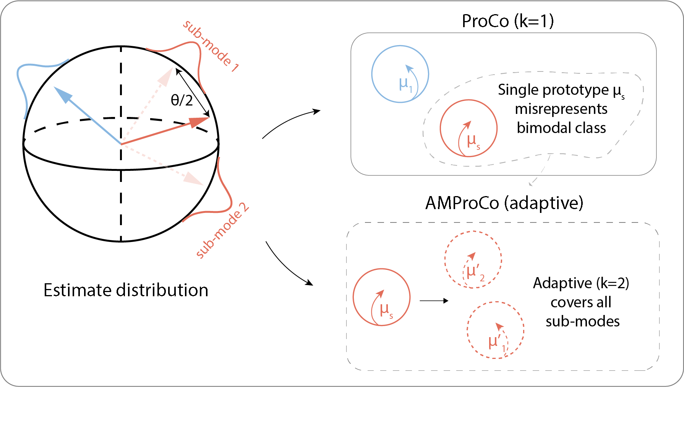
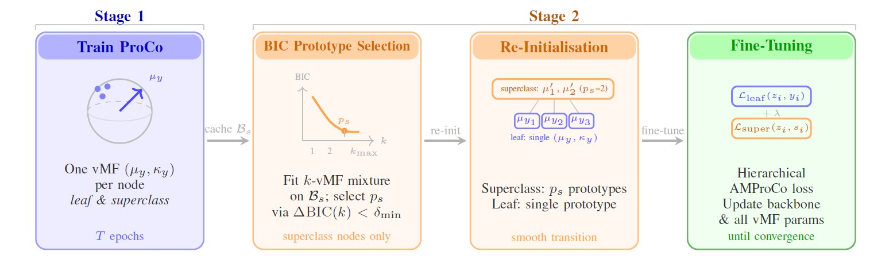

<div align="center">

# AMProCo

### Adaptive Multi-Prototype Probabilistic Contrastive Learning for Long-Tailed Recognition

[](https://www.python.org/)
[](https://pytorch.org/)
[](LICENSE)

**Mojtaba Masoudi · Sarah L.C. Giering · Noushin Eftekhari · Amanda Elineau · Blair Thornton**

National Oceanography Centre · Alan Turing Institute · University of Southampton

</div>

<p align="center">
  
</p>

<p align="center">
  <em>Figure: Adaptive multi-prototype allocation on the unit hypersphere. ProCo (k=1) misrepresents multi-modal
  superclasses with a single prototype; AMProCo adaptively selects k via BIC-based vMF mixture fitting, placing
  a prototype at each visual sub-mode.</em>
</p>

---

## Overview

Real-world visual data is both **hierarchical** and **long-tailed**: broad labels often hide multiple,
morphologically distinct sub-modes, while rare categories are chronically under-sampled. Standard
[ProCo](https://arxiv.org/abs/2403.06726)-style contrastive learning represents every class with a single
von Mises–Fisher (vMF) prototype on the unit hypersphere — an assumption that breaks down whenever a class
is genuinely multi-modal.

**AMProCo** is a superclass-aware, adaptive multi-prototype extension of probabilistic contrastive learning.
Instead of forcing every class into a single prototype (or naively assigning a fixed number of prototypes to
all classes), AMProCo:

- Trains a standard single-prototype contrastive encoder to obtain a stable embedding space (Stage 1).
- Fits a mixture of vMF distributions to the pooled embeddings of each **superclass**, and uses the
  **Bayesian Information Criterion (BIC)** to decide how many prototypes that superclass actually needs
  (Stage 2).
- Fine-tunes the backbone with a hierarchical contrastive loss that combines leaf-level and superclass-level
  terms, activating extra prototypes only where intra-class diversity is real.

Prototype allocation is applied **exclusively at the superclass level** — pooling samples across leaf classes
ensures statistically reliable mixture fitting even when individual leaf classes are severely under-sampled,
which is precisely the regime long-tailed datasets fall into. Leaf classes retain a single prototype
throughout training, so parameter growth stays modest and interpretable.

On **CIFAR-100-LT**, AMProCo improves top-1 accuracy by **+1–2 pp** over single-prototype ProCo. On our
**UVP6Net** plankton benchmark — where morphological diversity within a class is common — it improves
macro-F1 by **up to +5.7 pp**, with the largest gains on few-shot (tail) categories.

<p align="center">
  
</p>

<p align="center">
  <em>Figure: Two-stage AMProCo training pipeline — (1) single-prototype ProCo pre-training, (2) BIC-based
  prototype selection on pooled superclass embeddings, re-initialisation, and hierarchical fine-tuning.</em>
</p>

---

## Highlights

- 🧭 **Adaptive, not fixed** — the number of prototypes per superclass is chosen automatically via BIC, not
  hand-tuned.
- 🧬 **Superclass-aware** — pooling leaf classes within a superclass makes mixture fitting statistically
  identifiable even under severe long-tailed imbalance.
- 🔌 **Plug-and-play** — drops into any backbone trained with a standard contrastive objective; no large
  batches, memory banks, or extra queues required.
- 🔍 **Interpretable by design** — each learned prototype corresponds to a coherent visual sub-cluster
  (e.g. distinct plankton morphologies), giving domain experts explicit anchors instead of opaque feature
  vectors.
- ⚡ **Negligible overhead** — offline BIC fitting adds < 6 minutes one-off cost; per-iteration fine-tuning
  overhead is < 2 seconds; extra memory is < 50 KB.

---

## Results

### CIFAR-100-LT — Top-1 accuracy (%) across imbalance factors

| Method | IMF 100 | IMF 50 | IMF 10 |
|---|:---:|:---:|:---:|
| LDAM-DRW | 42.0 | 46.6 | 58.7 |
| BCL | 51.9 | 56.4 | 64.6 |
| ProCo (single-prototype) | 50.5 ± 0.3 | 54.1 ± 0.4 | 64.0 ± 0.2 |
| MProCo (fixed *k*=2) | 51.1 ± 0.7 | 55.3 ± 0.5 | 63.9 ± 0.3 |
| **AMProCo (ours, BIC-based)** | **52.0 ± 0.4** | **56.6 ± 0.5** | **64.9 ± 0.2** |

### CIFAR-100-LT (IMF=100) and UVP6Net — shot-wise breakdown

| Method | CIFAR Many | CIFAR Med | CIFAR Few | CIFAR All | UVP6 Many | UVP6 Med | UVP6 Few | UVP6 All |
|---|:---:|:---:|:---:|:---:|:---:|:---:|:---:|:---:|
| ProCo | 66.7 | 52.0 | 29.9 | 50.5 | 57.0 | 29.8 | 9.4 | 43.3 |
| MProCo (*k*=2) | 66.8 | 52.7 | 30.9 | 51.1 | 62.1 | 32.0 | 9.0 | 46.8 |
| **AMProCo** | **68.0** | **53.2** | **32.1** | **52.0** | **62.3** | **37.1** | **16.0** | **49.2** |

*(UVP6Net reported as macro-F1; Many >100 / Medium 20–100 / Few <20 training images. Full tables with standard
deviations and additional baselines are in the paper.)*

---

## Repository structure

```
AMProCo/
├── assets/               # Figures used in this README / paper
├── configs/               # YAML configs for training & evaluation
├── data_preparation/       # Scripts to prepare CIFAR-100-LT / UVP6Net
├── dataset/                 # Dataset classes / loaders
├── feature_extraction/       # Embedding extraction utilities
├── inference/                  # Prediction / evaluation scripts
├── models/                      # Backbones, vMF prototype heads, losses
├── tools/                        # BIC prototype-selection, plotting, misc utilities
├── train/                         # Training loops (Stage 1 & Stage 2)
├── main.py                         # Entry point (training / prediction)
├── environment.yml                  # Conda environment
├── requirements.txt                  # Pip requirements
└── README.md
```

---

## Getting started

### Prerequisites

- Linux, macOS, or Windows
- Python 3.8+
- CPU, or NVIDIA GPU (CUDA + cuDNN), or AMD GPU (ROCm, Linux only)

### Installation

```bash
git clone https://github.com/Mojtabamsd/AMProCo.git
cd AMProCo
```

Install PyTorch and other dependencies:

```bash
# pip
pip install -r requirements.txt

# or conda
conda env create -f environment.yml
```

> **AMD GPU users:** install [ROCm](https://rocm.docs.amd.com/) first (Linux only). If the ROCm conda
> package fails, install PyTorch via pip after creating the environment:
> `pip install torch==2.0.1 torchvision==0.15.2 --index-url https://download.pytorch.org/whl/rocm5.4.2`

### Data preparation

See [`data_preparation/`](data_preparation) for scripts to prepare:

- **CIFAR-100-LT** — long-tailed CIFAR-100 with configurable imbalance factor (IMF ∈ {10, 50, 100}) and its
  20-superclass / 100-leaf-class hierarchy.
- **UVP6Net** — public underwater plankton imagery ([Picheral et al., 2024](https://doi.org/10.17882/101948)),
  82 leaf classes aggregated into 20 taxonomic superclasses.

Update the corresponding paths in `configs/config.yaml` to point at your prepared dataset.

### Training

AMProCo trains in two stages, both driven from `configs/config.yaml` (set `method` / `stage` fields as
described in the config comments):

```bash
# Stage 1 — single-prototype ProCo pre-training
python main.py training -c ./configs/config.yaml -i 'sampling_path' -o 'output_path'

# Stage 2 — BIC-based prototype selection + hierarchical fine-tuning
# (runs automatically after Stage 1 when `adaptive: true` is set in the config;
#  see configs/config.yaml for the BIC threshold delta_min and kmax settings)
python main.py training -c ./configs/config_amproco.yaml -i 'sampling_path' -o 'output_path'
```

Key hyperparameters (set in the config file):

| Parameter | Description | Default |
|---|---|---|
| `kmax` | Maximum vMF components considered per superclass | 5 |
| `delta_min` | BIC improvement threshold to accept an extra prototype | 25 (CIFAR) / 12 (UVP6Net) |
| `lambda_super` | Weight of the superclass-level loss term | see config |
| `tau` | Contrastive temperature (fixed from Stage 1 during fine-tuning) | see config |

### Evaluation

```bash
python main.py prediction -c ./configs/config.yaml -i 'training_path' -o 'output_path'
```

This reports top-1 accuracy (CIFAR-100-LT) or macro-F1 (UVP6Net), broken down by many-/medium-/few-shot
subsets, and saves the fitted prototype assignments for downstream interpretability analysis.

---

## Method summary

AMProCo replaces the single vMF distribution per class with a mixture:

$$p(z \mid y) = \sum_{j=1}^{p_y} \pi_{y,j}\, f_{\text{vMF}}(z; \mu_{y,j}, \kappa_{y,j}), \qquad \sum_j \pi_{y,j} = 1$$

applied **only at the superclass level**. The number of components $p_s$ for each superclass is chosen via
an incremental BIC criterion:

$$\text{BIC}(k) = -2\ln \hat{\mathcal{L}}_k + p_k \ln N_s, \qquad \text{stop when } \text{BIC}(k-1)-\text{BIC}(k) < \delta_{\min}$$

Training then optimises a hierarchical loss combining the standard leaf-level ProCo loss with a
multi-prototype superclass-level contrastive term:

$$\mathcal{L}_{\text{AMProCo}} = \mathcal{L}_{\text{leaf}}(z_i, y_i) + \lambda\, \mathcal{L}_{\text{super}}(z_i, s_i)$$

See Section III of the paper for the full derivation, including the theoretical justification for
superclass-level (rather than leaf-level) prototype allocation under long-tailed distributions.

## Acknowledgments

This work was supported by the **ANTICS** project, funded by the European Research Council (ERC) under the
European Union's Horizon 2020 research and innovation programme (Grant Agreement No. 950212); by the European
Union under the Horizon Europe Programme (Grant Agreement No. 101082021, **MARCO-BOLO**); and by the Natural
Environment Research Council (**PARTITRICS**, NE/Y004329/1).

## License

This project is released under the [MIT License](LICENSE).
