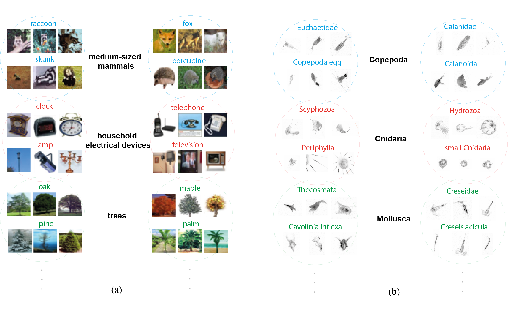

# AMProCo
Adaptive Multi-Prototype Probabilistic Contrastive Learning for Long-Tailed Recognition





## Prerequisites
- Linux or macOS or windows
- Python 3
- CPU or NVIDIA GPU (CUDA + cuDNN) or AMD GPU (ROCm, Linux only)

### Getting started
- Clone this repo:
```bash
git clone https://github.com/Mojtabamsd/AMProCo AMP
cd AMP
```

- Install [PyTorch](http://pytorch.org) and other dependencies (e.g., torchvision).

  **AMD GPU users:** Install [ROCm](https://rocm.docs.amd.com/) on your system first (Linux only). The requirements use the ROCm build of PyTorch.

  For pip users, please type the command `pip install -r requirements.txt`.

  For Conda users, you can create a new Conda environment using `conda env create -f environment.yml`. If the ROCm conda package fails, AMD users can install PyTorch via pip after creating the env: `pip install torch==2.0.1 torchvision==0.15.2 --index-url https://download.pytorch.org/whl/rocm5.4.2`


### Train a model
```bash
python main.py training -c ./configs/config.yaml -i 'sampling_path' -o 'output_path'
```

### Test a model
```bash
python main.py prediction -c ./configs/config.yaml -i 'training_path' -o 'output_path'
```